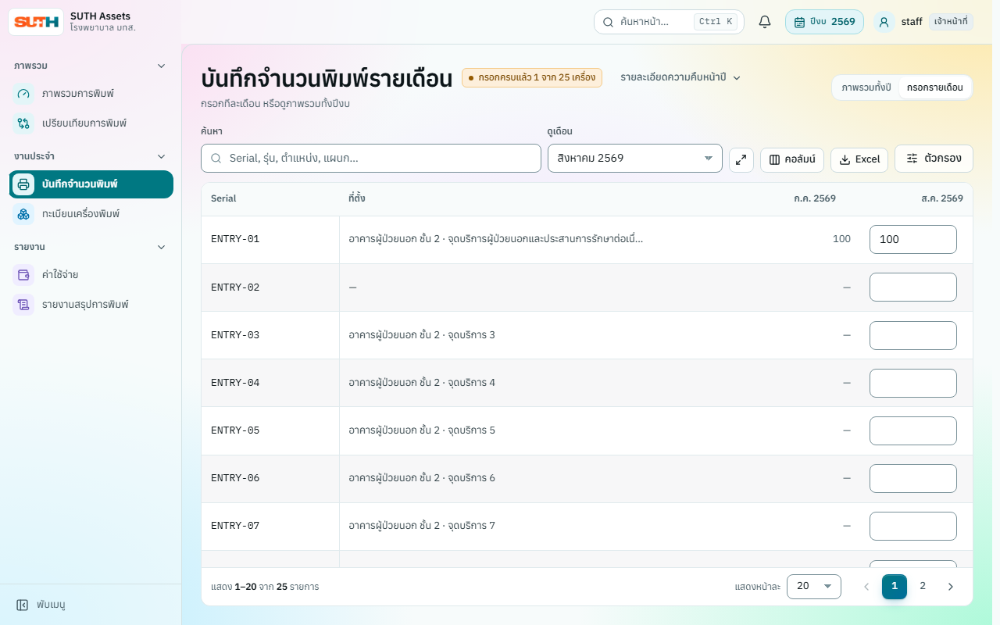
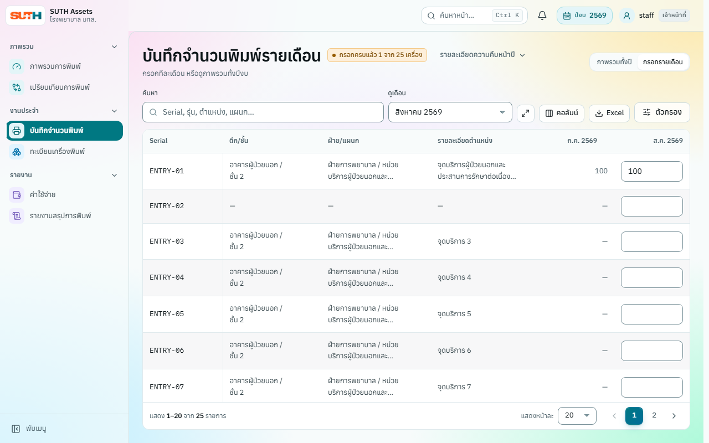
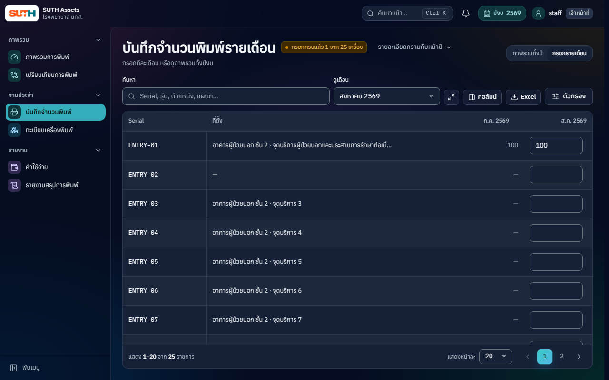
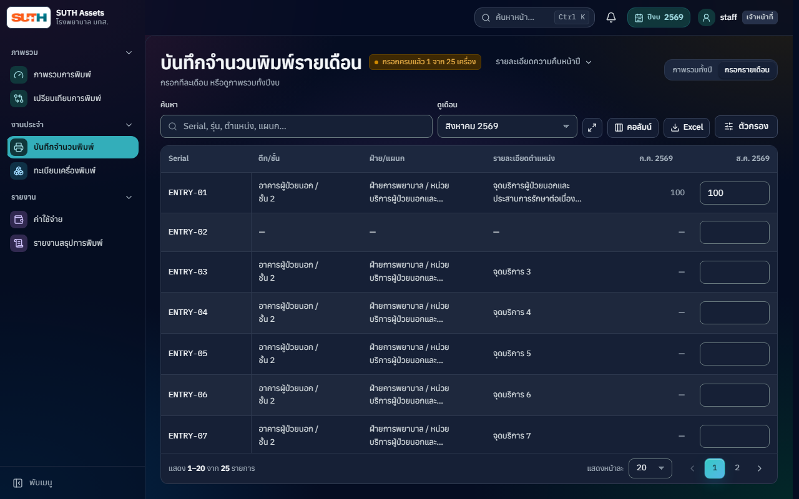
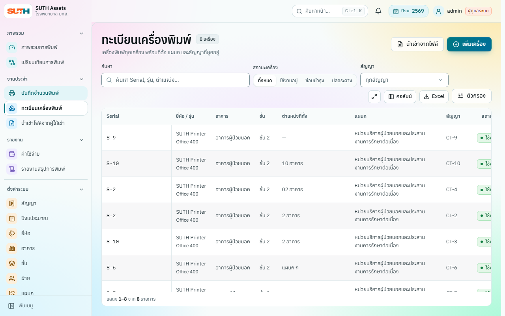
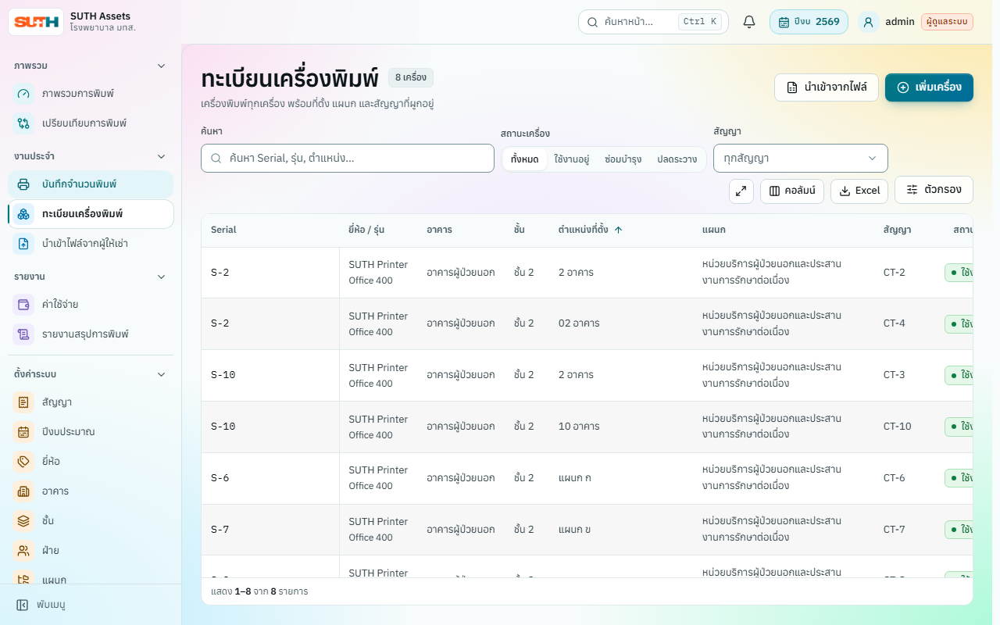
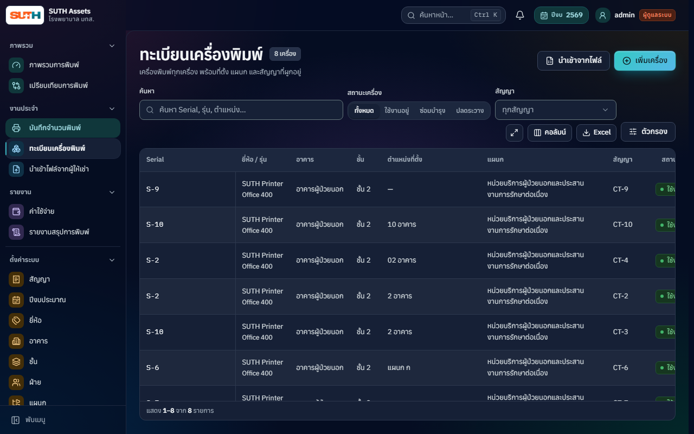
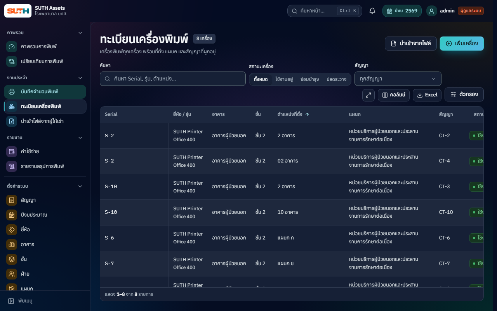

# Desktop table delivery evidence (#276–277)

Fixed review snapshots captured on 2026-10-08 with synthetic HTTP fixtures, never production or hospital records. Before uses baseline `4b86e6cf73d56219672f8601a0de3797aa5aaf52`; after uses the implementation delivered alongside these images. All displayed usernames and device/location names belong to fixtures. These snapshots document this delivery rather than the current UI of every future version.

The behavior checks and fixture data live in [entry-location-columns.spec.js](../../../apps/web/e2e/entry-location-columns.spec.js) and [registry-detail-sort.spec.js](../../../apps/web/e2e/registry-detail-sort.spec.js). They cover 1280×800 and 1440×900 in light/dark themes. Before snapshots were captured while the new column/default-sort assertions failed; after snapshots are accompanied by passing public behavior checks. Session restoration fixtures bind serialized memory to the synthetic user, matching the application's session-memory contract.

## Monthly entry, 1280×800

| Theme | Before | After |
|---|---|---|
| Light |  |  |
| Dark |  |  |

## Registry, 1280×800

| Theme | Before | After |
|---|---|---|
| Light |  |  |
| Dark |  |  |

## 1440×900 snapshots

- Entry: [before light](entry-before-1440-light.png), [after light](entry-after-1440-light.png), [before dark](entry-before-1440-dark.png), [after dark](entry-after-1440-dark.png).
- Registry: [before light](registry-before-1440-light.png), [after light](registry-after-1440-light.png), [before dark](registry-before-1440-dark.png), [after dark](registry-after-1440-dark.png).

Images alone do not establish accessibility or usability compliance. Production, real-user trials, assistive-technology testing, and mobile/tablet design or usability review are outside this delivery. A narrow 390px move-and-close regression preserves the existing card view's visible keyboard return target; it does not extend the desktop design scope. Usage instructions are maintained in [the report workflow guide](../../how-to/use-report-workflow.md).
