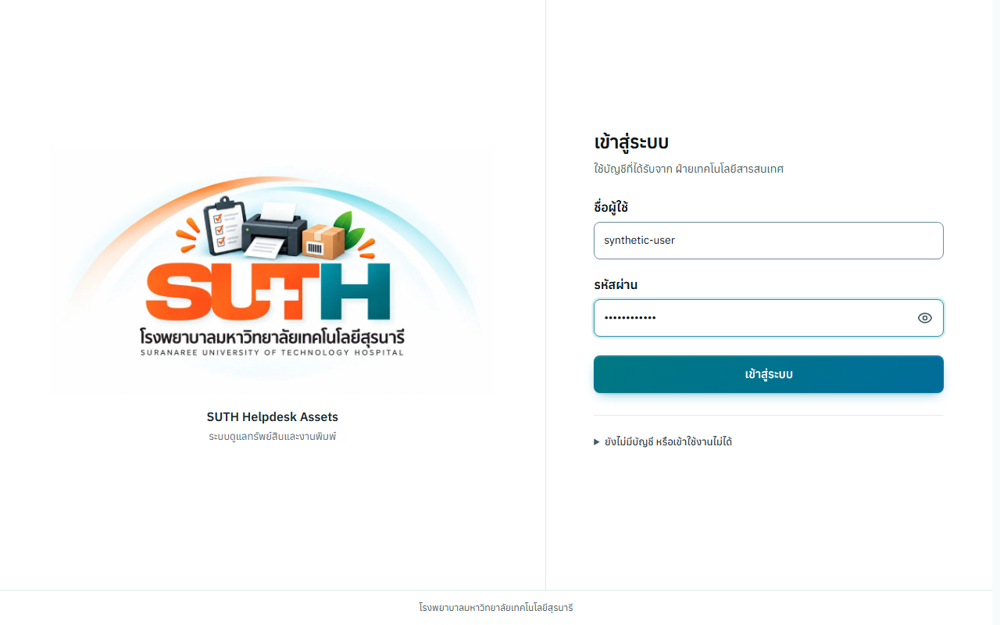
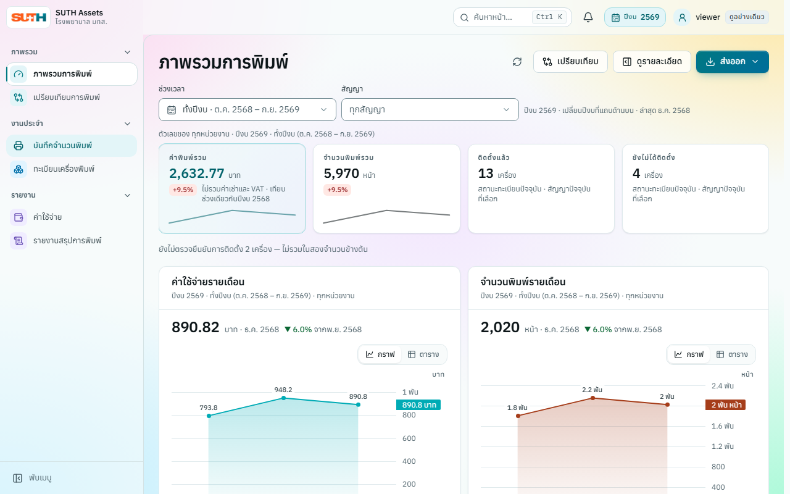
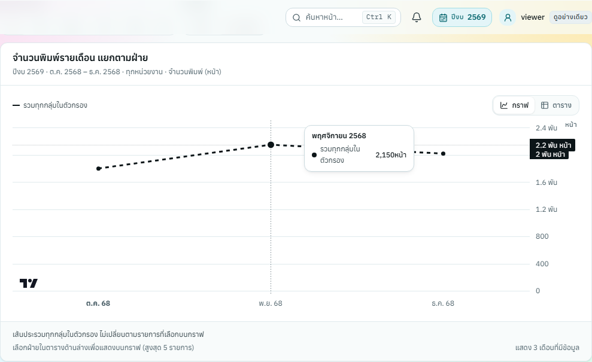

# ภาพหลักฐาน feedback #271–275

Snapshot วันที่ 2026-10-08 จาก build ที่รวมงาน #271–275 บน code commit `4e8e38fe39786d1e965cc8992b8b7c2f1698a54b` ขนาด desktop 1280×800 ธีมสว่าง ข้อมูลและบัญชีในภาพเป็น HTTP fixtures สังเคราะห์

เก็บภาพชุดนี้เพื่อให้ PR เปิดดูหลักฐานได้หลังลบ feature branch ข้อกำหนดอยู่ใน [Issue #270 และงานย่อย](https://github.com/saritrungj/suth-helpdesk-assets/issues/270); กฎเงินและการติดตั้งอยู่ใน [domain](../../explanation/domain.md) และ ADR ที่เอกสารนั้นอ้างอิง

## ล็อกอิน

ชื่อช่องกรอกเด่นขึ้น ปุ่มตาแยกสถานะ และปุ่มเข้าสู่ระบบไม่มีลูกศร ตรวจด้วย [login-identity.spec.js](../../../apps/web/e2e/login-identity.spec.js)

## ภาพรวม

KPI การติดตั้งและรายการที่ยังไม่ตรวจยืนยันแสดงร่วมกับยอดพิมพ์ โดยซ่อนข้อความ 2% บนจอ ชื่อ/บทบาทผู้ใช้และเมนูบันทึกจำนวนพิมพ์อยู่ในภาพเดียวกัน ตรวจด้วย [installation-kpi.spec.js](../../../apps/web/e2e/installation-kpi.spec.js) และ [deduction-presentation.spec.js](../../../apps/web/e2e/deduction-presentation.spec.js)

## เส้นรวม

เมื่อเอากลุ่มที่เลือกออก เส้นประรวมทุกกลุ่มในตัวกรองและชื่อขอบเขตในกล่องค่ายังคงอยู่ ตรวจด้วย [comparison-total.spec.js](../../../apps/web/e2e/comparison-total.spec.js)

รัน `npm run verify` เพื่อสร้างภาพปัจจุบันใน `apps/web/e2e/.artifacts/`; snapshot ที่นี่คงไว้เป็นหลักฐานของ PR ชุดนี้ ผลทดสอบ build รวมและข้อจำกัดบันทึกใน PR
