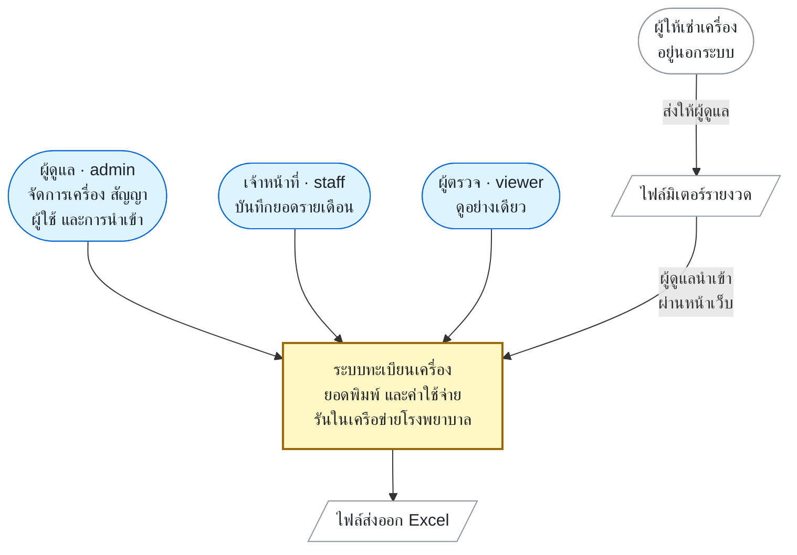
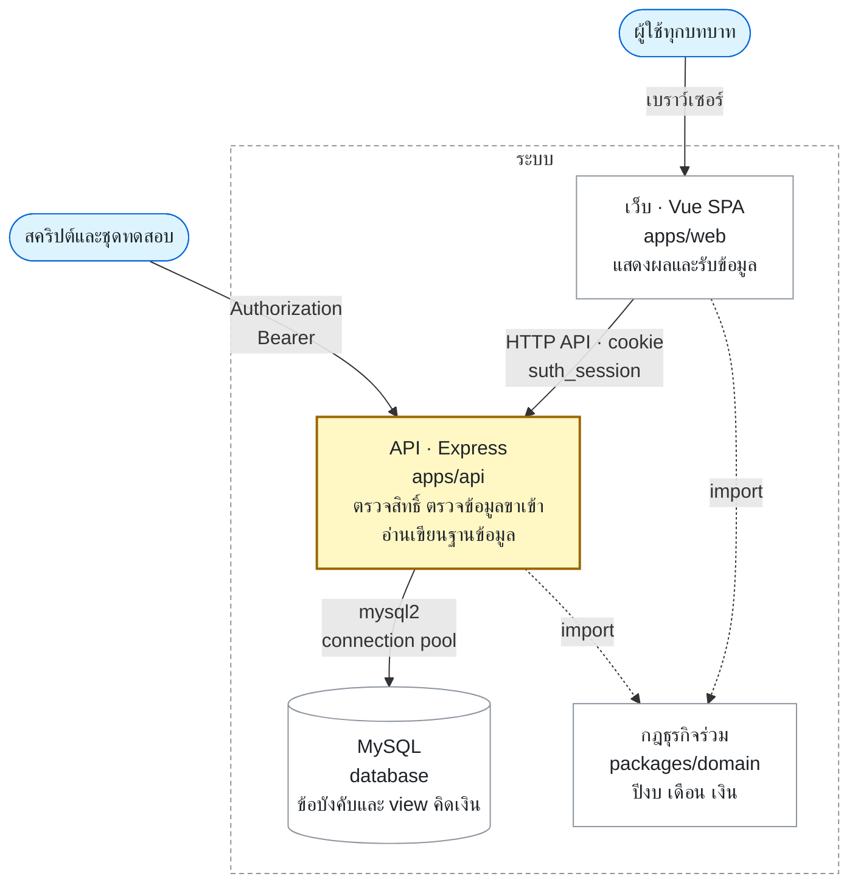

# สถาปัตยกรรม

เอกสารนี้อธิบาย **ทำไม** โครงสร้างถึงเป็นแบบนี้ ส่วน **มีอะไรบ้าง** ให้อ่านจากโค้ดโดยตรง เพราะรายการไฟล์ที่ copy มาไว้ในเอกสารจะล้าสมัยเสมอโดยไม่มีอะไรเตือน

## ภาพรวมระบบ

รูปทั้งสองวาดตาม [C4 model](https://c4model.com/) ระดับ 1 และ 2 ระดับที่ลึกกว่านั้นให้อ่านจากโค้ด

### ระบบกับสิ่งรอบข้าง (C4 ระดับ 1)



ระบบไม่เชื่อมกับระบบอื่นโดยอัตโนมัติ ข้อมูลเข้าออกผ่านไฟล์ที่คนถือเท่านั้น

### ส่วนที่รันแยกกัน (C4 ระดับ 2)



API เป็นทางเดียวเข้าฐานข้อมูลและเป็นที่เดียวที่บังคับสิทธิ์ จึงเป็นกรอบเหลือง ดู [ADR-0012](../decisions/0012-remove-mcp-server.md) เส้นประคือการ import โค้ด ไม่ใช่การเรียกผ่านเครือข่าย

ระบบทำงานภายในโรงพยาบาล ข้อมูลไม่ออกนอกเครือข่าย จึงไม่พึ่ง managed service ใดๆ

เบราว์เซอร์รับ `suth_session` จาก API หลังล็อกอินแล้วแนบ cookie ไปกับคำขอเอง
ส่วน script และการทดสอบยังใช้ `Authorization: Bearer` ได้ตาม
[ขอบเขต API](../reference/api.md) และ [ADR-0006](../decisions/0006-session-cookie-instead-of-localstorage.md)

## repository เป็น workspace เดียว

```text
apps/api/          Express API
apps/web/          Vue SPA
packages/domain/   กฎธุรกิจที่ทั้งสองฝั่งใช้ร่วมกัน
database/          schema, migration, seed
docs/              เอกสารชุดนี้
```

เดิม backend และ frontend เป็นสองโปรเจกต์แยกกันที่แชร์โค้ดไม่ได้เลย ตรรกะปีงบจึงถูกเขียนสองรอบแล้วเพี้ยนคนละทาง — ฝั่ง API ใช้ ต.ค.–ก.ย. ถูก ส่วนฝั่งเว็บเดาเป็น ม.ค.–ธ.ค. ผิด `packages/domain` มีอยู่เพื่อไม่ให้เกิดเรื่องนี้อีก ดู [ADR-0004](../decisions/0004-workspace-and-feature-folders.md)

**กฎ:** ถ้าคำตอบต้องเหมือนกันทั้งสองฝั่ง มันต้องอยู่ใน `packages/domain` ห้าม copy ไปเขียนซ้ำ

## โค้ดฝั่ง API แบ่งตามความสามารถ

`apps/api/index.js` เป็น entry ที่ mount route เท่านั้น โค้ดจริงอยู่ใน [`apps/api/src/`](../../apps/api/src/) แบ่งเป็นโฟลเดอร์ตามสิ่งที่ระบบทำ เช่น `devices/` และ `print-usage/` โดยมี `shared/` เป็นชั้นพื้นฐานที่ทุกโฟลเดอร์ใช้ รายชื่อปัจจุบันให้ดูจากโฟลเดอร์นั้นโดยตรง

เหตุผลคือชื่อโฟลเดอร์ควรบอกว่าระบบนี้ทำอะไร ไม่ใช่บอกว่าเขียนด้วยอะไร และการแก้ความสามารถหนึ่งควรเปิดโฟลเดอร์เดียว ไม่ใช่ไล่เปิดสามโฟลเดอร์ตามชนิดของไฟล์

**กฎ:** เพิ่มความสามารถใหม่ = เพิ่มโฟลเดอร์ใหม่ ห้ามเอา `routes/` หรือ `controllers/` กลับมา และถ้าโค้ดถูกใช้แค่ feature เดียว ให้อยู่ในโฟลเดอร์ของ feature นั้น อย่ายัดเข้า `shared/`

middleware ตรวจสิทธิ์อยู่ใต้ `auth/` เพราะ auth เป็นเจ้าของ feature อื่นยืมไปใช้ ชื่อไฟล์ตั้งเป็น `require-auth` / `require-admin` / `require-staff` ให้อ่านแล้วรู้ทันทีว่าบรรทัดนั้นบังคับอะไร

## โค้ดฝั่งเว็บ

- route และ navigation อยู่ใน `apps/web/src/router/` — **มีแต่ `main.js` ที่ import โมดูลนี้ได้** โค้ดที่อยู่นอก component ต้องหยิบ router จาก `apps/web/src/lib/app-router.js` ส่วนหน้าเว็บใช้ `useRouter()` ตามปกติ เพราะวง import ที่วนกลับมาหา `router/index.js` ทำให้ hot reload พังเป็นจอขาวด้วย `Cannot access 'router' before initialization` (`lib/app-router.test.js` เฝ้ากฎนี้และเฝ้าไม่ให้มีวง import ใดๆ ในฝั่งเว็บ)
- HTTP client กลางอยู่ที่ `apps/web/src/services/api.js` — จุดเดียวที่ตั้งค่าการส่ง cookie และดัก 401
- ชั้นดึงข้อมูลกลางอยู่ที่ `apps/web/src/api/queries.js` ผ่าน TanStack Query — เฉพาะข้อมูลอ่านที่ใช้ซ้ำข้ามหน้า การเขียนยังยิง `services/api.js` ตรงๆ ดู [ADR-0009](../decisions/0009-tanstack-query-as-the-data-layer.md)
- state ที่ใช้ร่วมหลายหน้าอยู่ใน `apps/web/src/store/` เขียนด้วย reactive ของ Vue ตรงๆ ยังไม่มี state manager
- หน้าตาของระบบแยกออกมาเป็นชั้นของตัวเอง (`design/` token, `ui/` component กลาง, `app/` เปลือกของแอป) แล้วบังคับให้ทุกหน้าจอ (`views/`, `components/`) เรียกผ่านชั้นนั้นเท่านั้น ห้ามเขียนคลาสสีของ Tailwind ตรงๆ — ดู [Design system ของหน้าเว็บ](design-system.md) และ [ADR-0008](../decisions/0008-design-system-tokens-and-ui-kit.md)

## ฐานข้อมูล

`database/schema.sql` เป็น source of truth ของฐานข้อมูลใหม่ ส่วน `database/migrations/*.sql` เป็นการเปลี่ยนแปลงแบบมีลำดับสำหรับฐานข้อมูลที่มีอยู่แล้ว — ดู [วิธีรัน](../how-to/run-migrations.md)

กฎที่บังคับได้ในระดับฐานข้อมูลให้บังคับที่นั่น เช่น `UNIQUE KEY (device_id, month)` และ `CHECK` ที่กันเดือน พ.ศ. หลุดเข้ามา เพราะการบังคับในโค้ดอย่างเดียวข้ามได้ทุกครั้งที่มีคนเปิด phpMyAdmin
