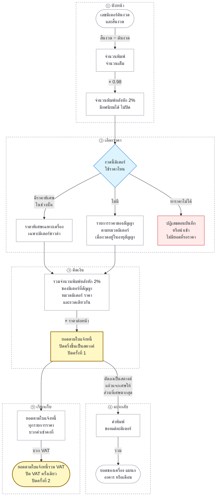

# กฎธุรกิจและโดเมน

เอกสารนี้อธิบายว่าระบบตัดสินอะไรจากอะไร — อ่านก่อนแก้โค้ดที่แตะปีงบ ยอดพิมพ์ หรือการคิดเงิน สำหรับโครงสร้างระบบดู [สถาปัตยกรรม](architecture.md) สำหรับตารางและ endpoint ดู [reference](../reference/)

## เป้าหมาย

รวมข้อมูลเครื่องพิมพ์และเครื่องถ่ายเอกสารของโรงพยาบาลไว้ในแหล่งเดียว ตั้งแต่ทะเบียนอุปกรณ์ สถานที่ตั้ง หน่วยงาน สัญญา ราคาต่อหน้า และยอดพิมพ์รายเดือน ไปจนถึงรายงานการใช้งานและค่าใช้จ่ายตามปีงบประมาณ

## บทบาทผู้ใช้

| บทบาท | สิทธิ์หลัก |
|---|---|
| `admin` | ดูข้อมูลและจัดการอุปกรณ์ Master Data สัญญา ผู้ใช้ และการนำเข้า |
| `staff` | ดูข้อมูลและบันทึกยอดพิมพ์รายเดือน |
| `viewer` | ดู Dashboard ทะเบียน และรายงานโดยไม่แก้ข้อมูล |

Middleware ฝั่ง API เป็นขอบเขตความปลอดภัยที่เชื่อถือได้ ส่วนการซ่อนเมนูฝั่งเว็บเป็นเพียงส่วนติดต่อผู้ใช้ ห้ามใช้เป็นด่านกันสิทธิ์

## ความสามารถของระบบ

- Dashboard และ KPI ตามเดือน อาคาร ฝ่าย และแผนก
- ทะเบียนอุปกรณ์พร้อมสถานะ `active`, `repair`, `retired`
- ประวัติการย้ายอาคาร ชั้น ตำแหน่ง ฝ่าย และแผนก
- Master Data สำหรับยี่ห้อ อาคาร ชั้น ฝ่าย แผนก และปีงบ
- สัญญาและราคาต่อหน้า รวมถึงราคาที่กำหนดเฉพาะเครื่อง
- การบันทึกยอดพิมพ์ทีละรายการ หลายรายการ หรือครบทั้งปีงบ
- รายงานค่าใช้จ่าย การเปรียบเทียบ และยอดพิมพ์รายเครื่อง
- การนำเข้าทะเบียนอุปกรณ์และยอดมิเตอร์จาก CSV/Excel

## ปีงบประมาณและเดือน

นี่คือส่วนที่พังมาแล้วสองรอบ อ่านให้จบก่อนแก้อะไรที่เกี่ยวกับเดือน

- ปีงบราชการไทยเริ่ม **1 ตุลาคม** และสิ้นสุด **30 กันยายน** จึงคร่อมสองปีปฏิทินเสมอ ปีงบ 2569 คือ ต.ค. 2025 ถึง ก.ย. 2026 — ดู [ADR-0001](../decisions/0001-thai-fiscal-year-oct-sep.md)
- `fiscal_year.year` แสดงเป็น **พ.ศ.** แต่ `start_month`, `end_month` และ `print_transactions.month` เก็บเป็น **ค.ศ.** รูปแบบ `YYYY-MM`
- ระบบรับค่าเดือนได้ทั้ง พ.ศ. และ ค.ศ. ที่ขาเข้า แล้ว normalize เป็น ค.ศ. เสมอ ส่วนการแสดงผลบวก 543 กลับเป็น พ.ศ. — ดู [ADR-0002](../decisions/0002-store-months-in-common-era.md)
- การแปลงทั้งหมดมี source of truth ที่ [`packages/domain/`](../../packages/domain/) ห้ามคำนวณเองซ้ำที่อื่น
- query ที่กรองตามปีงบต้องใช้ `month BETWEEN start_month AND end_month` **ห้าม** ใช้ `month LIKE 'YYYY-%'` เพราะปีงบไม่เท่ากับปีปฏิทิน

## ยอดพิมพ์และค่าใช้จ่าย

กฎหัก 2% และการปัดเงินอยู่ใน [ADR-0017](../decisions/0017-two-percent-page-deduction.md) และ [ADR-0022](../decisions/0022-round-at-invoice-line-and-allocate.md) คำศัพท์อยู่ใน [CONTEXT.md](../../CONTEXT.md)

กรอบเหลืองคือจุดที่เงินถูกปัด กรอบแดงคือยอดที่ระบบไม่รับ

| ขั้น | คิดต่อ | กฎอยู่ที่ |
|---|---|---|
| ① นับหน้า | มิเตอร์ต่องวด | [ADR-0017](../decisions/0017-two-percent-page-deduction.md), [ADR-0023](../decisions/0023-contract-term-price-lines-and-meters.md) |
| ② เลือกราคา | มิเตอร์ต่องวด | [ADR-0019](../decisions/0019-effective-pricing-history.md), [ADR-0021](../decisions/0021-contract-price-applies-on-save.md) |
| ③ คิดเงิน | สัญญา หมวดมิเตอร์ และราคาเดียวกัน ต่องวด | [ADR-0022](../decisions/0022-round-at-invoice-line-and-allocate.md) |
| ④ แบ่งกลับ | มิเตอร์ต่องวด แล้วรวมตามมุมที่รายงานต้องการ | [ADR-0022](../decisions/0022-round-at-invoice-line-and-allocate.md) |
| ⑤ เรียกเก็บ | สัญญาต่องวด | [ADR-0023](../decisions/0023-contract-term-price-lines-and-meters.md) |

เงินถูกปัดสองจุดเท่านั้น คือที่ยอดตามใบแจ้งหนี้ของรายการราคา และที่ VAT ของสัญญา ตัวอย่างรายการราคา 0.365 บาทต่อหน้า มีสามมิเตอร์ในงวดเดียวกัน:

| มิเตอร์ | จำนวนพิมพ์ | หลังหัก 2% | ส่วนก่อนปัด (บาท) | ตัดลง | แจกเศษ | ค่าพิมพ์ |
|---|---:|---:|---:|---:|---:|---:|
| ก | 101 | 98.98 | 36.1277 | 36.12 | +0.01 | 36.13 |
| ข | 103 | 100.94 | 36.8431 | 36.84 | — | 36.84 |
| ค | 37 | 36.26 | 13.2349 | 13.23 | +0.01 | 13.24 |
| รวม | 241 | 236.18 | 86.2057 | 86.19 | +0.02 | **86.21** |

ยอดตามใบแจ้งหนี้คือ 236.18 × 0.365 = 86.2057 ปัดเป็น 86.21 บาท ถ้าปัดทีละมิเตอร์แล้วบวกจะได้ 86.20 ซึ่งไม่ตรงใบแจ้งหนี้ เศษสองสตางค์จึงแจกให้มิเตอร์ ก และ ค ที่มีเศษมากที่สุด

- `(meter_id, month)` ต้องไม่ซ้ำ เครื่องหนึ่งมีหลายมิเตอร์ได้ และการบันทึกเดือนเดิมคือการ update ยอดเดิม
- จำนวนพิมพ์หลังหัก 2% เท่ากับจำนวนพิมพ์ × 0.98 (`pages × 0.98`)
- ราคามาจากราคาเฉพาะเครื่องของช่วงนั้นก่อน มิฉะนั้นใช้รายการราคาของสัญญาตามหมวดมิเตอร์เมื่อเดือนอยู่ในอายุสัญญา ([ADR-0019](../decisions/0019-effective-pricing-history.md), [ADR-0021](../decisions/0021-contract-price-applies-on-save.md))
- ทางเขียนทุกทางปฏิเสธยอดที่หาราคาไม่ได้ จึงไม่มีสถานะรอราคาในรายงาน
- รวมจำนวนพิมพ์หลังหัก 2% ของรายการราคาเดียวกันในงวด คูณราคา ปัดเป็นสตางค์ แล้วกระจายเศษกลับรายมิเตอร์ด้วย largest remainder ([ADR-0022](../decisions/0022-round-at-invoice-line-and-allocate.md))
- ยอดตามใบแจ้งหนี้รวมค่าพิมพ์ ค่าเช่าคงที่ของทุกเดือนในอายุสัญญา และ VAT ที่ปัดครั้งเดียวจากยอดก่อน VAT

## ประวัติการย้ายเครื่อง

- `devices` เก็บสถานที่และหน่วยงาน **ปัจจุบัน**
- `device_location_history` เก็บช่วงย้อนหลัง โดย `effective_to = NULL` หมายถึงช่วงปัจจุบัน
- รายงานย้อนหลังต้องจัดยอดของแต่ละเดือนให้สถานที่และหน่วยงานที่มีผล **ในเดือนนั้น** ห้ามใช้ค่าปัจจุบันย้อนทับอดีต ไม่งั้นยอดของแผนกเดิมจะถูกนับเป็นของแผนกใหม่ทั้งหมด

> ข้อจำกัดที่ยังมีอยู่: ฐานข้อมูลปัจจุบันไม่ได้กันช่วงเวลาใน `device_location_history` ทับกัน การกันจึงอยู่ในโค้ดเท่านั้น ซึ่งทางเข้าอื่น (phpMyAdmin, SQL มือ) ข้ามได้ — ดู [ADR-0005](../decisions/0005-database-engine.md) หากข้อมูลเดิมมีช่วงซ้อน รายงานเลือกช่วงที่เริ่มล่าสุดและใช้ `id` เป็นตัวตัดสินตาม [ADR-0014](../decisions/0014-resolve-overlapping-location-history.md)
