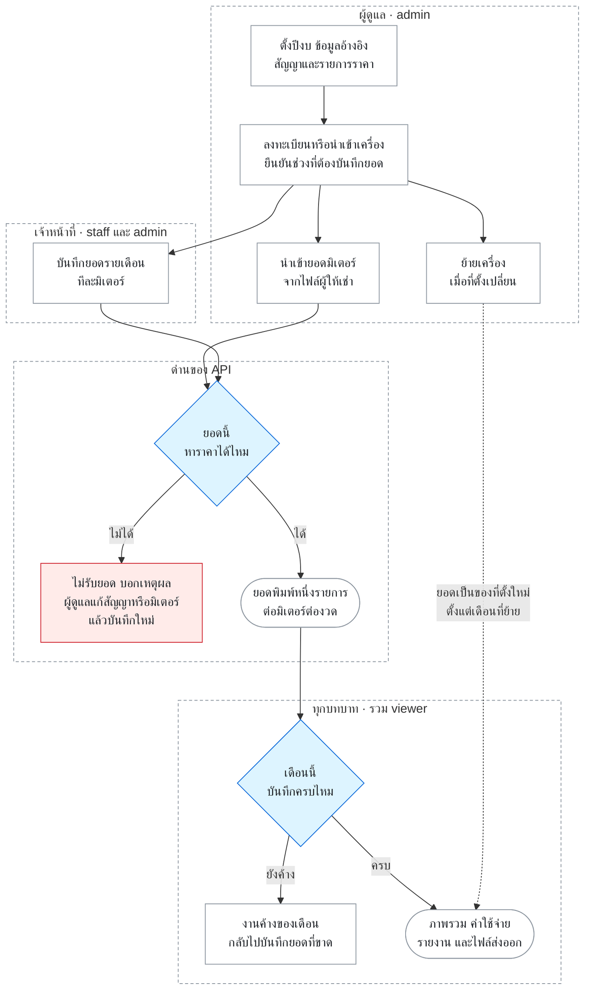

# เส้นทางงานสำคัญของระบบ

หน้านี้เชื่อมผลลัพธ์ที่ผู้ใช้ต้องการเข้ากับกฎธุรกิจและหลักฐานตรวจสอบ ใช้ตอนเขียน Issue
และตรวจ PR: ระบุว่าเปลี่ยนเส้นทางใด แล้วเปิดเอกสารกฎและชุดตรวจของเส้นทางนั้น
รายละเอียดคอลัมน์และ endpoint ให้ดู [reference](../reference/) ส่วนวิธีรันอยู่ที่
[ตรวจการเปลี่ยนแปลง](../how-to/verify-changes.md) เพื่อไม่เก็บสำเนาที่ล้าสมัยไว้ที่นี่

## งานของผู้ใช้

รูปนี้แสดงว่างานของแต่ละบทบาทต่อกันอย่างไรในหนึ่งรอบเดือน รายละเอียดของแต่ละเส้นทางอยู่ในตารางถัดไป

กรอบประคือบทบาทที่ทำงานนั้นได้ สิทธิ์บังคับที่ API ไม่ใช่ที่เมนู ดู [บทบาทผู้ใช้](domain.md#บทบาทผู้ใช้) เมื่อผู้ตรวจพบยอดไม่ตรงใบแจ้งหนี้ ผู้ดูแลหรือเจ้าหน้าที่แก้ยอดต้นทางแล้วรอบนี้เดินซ้ำจากด่านของ API

| เส้นทางและผู้ทำ | ผลที่ต้องพิสูจน์ | กฎที่เป็น source of truth | หลักฐานที่มีใน repo / ช่องว่าง |
|---|---|---|---|
| ผู้ดูแลตั้งปีงบ ข้อมูลอ้างอิง และสัญญา | ช่วงปีงบถูกต้อง; ราคาของแต่ละหมวดและช่วงเวลาที่มีผลตรวจสอบได้ก่อนบันทึก | [กฎโดเมน](domain.md), [ADR-0001](../decisions/0001-thai-fiscal-year-oct-sep.md), [ADR-0019](../decisions/0019-effective-pricing-history.md), [ADR-0023](../decisions/0023-contract-term-price-lines-and-meters.md) | unit test ของ `packages/domain/` และ `apps/api/src/contracts/routes.test.js`; `apps/web/e2e/contract-preview.spec.js` ในชุด DB พิสูจน์ว่ายอดย้อนหลังหลังแก้ราคาเท่ากับที่ดูผลกระทบแสดง และ `contract-edit.spec.js` ตรวจทางหน้าเว็บ; ยังไม่มีเทสแก้ราคาของสัญญาที่มีหลายรายการราคาหรือราคาพิเศษเฉพาะเครื่อง |
| ผู้ดูแลลงทะเบียนหรือนำเข้าเครื่อง และยืนยันช่วงรับผิดชอบ | เครื่องและมิเตอร์มีตัวตนถูกต้อง; แถวผิดถูกปฏิเสธพร้อมเหตุผล; การนำเข้าซ้ำไม่สร้างข้อมูลซ้ำ | [รูปแบบนำเข้า](../reference/import-format.md), [ADR-0018](../decisions/0018-separate-installation-status.md), [ADR-0026](../decisions/0026-raw-registry-import.md) | `apps/api/src/import/*.test.js`, `apps/web/e2e/import-wizard.spec.js` (fixture), `apps/web/e2e/import-session.spec.js` (เขียนฐานจริงตั้งแต่อัปโหลดถึงบันทึก) |
| ผู้ดูแลนำเข้ายอดมิเตอร์ | preview ระบุแถวที่รับ/ปฏิเสธ; ยืนยันแล้วอ่านยอดกลับได้; การนำเข้าซ้ำไม่เพิ่มยอดซ้ำ | [รูปแบบนำเข้า](../reference/import-format.md), [กฎยอดพิมพ์](domain.md#ยอดพิมพ์และค่าใช้จ่าย), [ADR-0002](../decisions/0002-store-months-in-common-era.md) | `apps/api/src/import/vendor-meter.test.js`, `apps/web/src/components/print-usage-import.test.js`, `apps/web/e2e/prototype.spec.js` แบบ fixture; `apps/web/e2e/import-session.spec.js` ในชุด DB นำเข้าไฟล์→ฐาน→หน้าค่าใช้จ่าย และนำเข้าไฟล์เดิมซ้ำแล้วไม่มียอดเพิ่ม; ยังไม่มีเทสนำเข้าซ้ำด้วยไฟล์ที่ยอดเปลี่ยน (เขียนทับ) จนถึงรายงาน |
| ผู้ดูแลย้ายเครื่อง | เดือนย้อนหลังยังสังกัดอาคาร/ฝ่ายเดิมตามช่วงที่มีผล | [กฎโดเมน](domain.md#ประวัติการย้ายเครื่อง), [ADR-0014](../decisions/0014-resolve-overlapping-location-history.md) | `apps/api/src/shared/effective-location-sql.test.js` และ `apps/web/e2e/report-workflow.spec.js` ในชุด DB; ข้อมูลเดิมที่มีช่วงซ้อนต้องตรวจตาม ADR |
| เจ้าหน้าที่บันทึกยอดรายเดือน | ยอดที่บันทึกอ่านกลับได้; เดือนว่างต่างจากยอดศูนย์; จำนวนเครื่องที่ค้างอิงช่วงรับผิดชอบจริง | [กฎโดเมน](domain.md#ปีงบประมาณและเดือน), [ADR-0002](../decisions/0002-store-months-in-common-era.md), [ADR-0018](../decisions/0018-separate-installation-status.md) | `apps/web/e2e/month-entry.spec.js` ในชุด DB และ `packages/domain/*month*.test.js`; ต้องตรวจ ก.ย.→ต.ค. เมื่อแก้ปีงบ/เดือน |
| ผู้ตรวจดูค่าใช้จ่ายและรายงาน | ยอดค่าพิมพ์รายมิเตอร์รวมเป็นยอดค่าพิมพ์ตามใบแจ้งหนี้ทุกสตางค์; ยอดตามใบแจ้งหนี้รวมค่าเช่าคงที่และ VAT แยกตามกฎ; เดือนที่ไม่มีข้อมูลไม่กลายเป็นศูนย์; รายงานย้อนหลังใช้ที่ตั้งตามเดือน | [ADR-0017](../decisions/0017-two-percent-page-deduction.md), [ADR-0022](../decisions/0022-round-at-invoice-line-and-allocate.md), [กฎโดเมน](domain.md#ยอดพิมพ์และค่าใช้จ่าย), [คู่มือรายงาน](../how-to/use-report-workflow.md) | `packages/domain/money.test.js`, `apps/web/e2e/report-workflow.spec.js` ในชุด DB และ `print-comparison.spec.js` แบบ fixture; ชุด DB ต้องรันจริงก่อน merge งานเงิน/รายงาน |
| ผู้ใช้แต่ละบทบาทเข้าระบบ | admin/staff/viewer เห็นและแก้ได้ตามสิทธิ์; คำขอไม่มีสิทธิ์ถูกปฏิเสธที่ API | [กฎโดเมน](domain.md#บทบาทผู้ใช้), [ADR-0006](../decisions/0006-session-cookie-instead-of-localstorage.md) | `apps/api/test/auth.test.js`, `apps/web/e2e/login.spec.js`; ก่อนส่งมอบงานสิทธิ์ต้อง smoke test ทุก role ที่กระทบตาม [คู่มือตรวจ](../how-to/verify-changes.md) |

ช่องว่างในตารางคือขอบเขตที่ต้องระบุใน PR ว่าได้เพิ่มการพิสูจน์แล้ว หรือยังไม่ได้ตรวจและเพราะอะไร
อย่าอ่านชื่อไฟล์เทสเป็นหลักฐานว่าเคสหนึ่งผ่านจริง: ต้องแนบผลรันของ commit ที่เสนอ

| เส้นทาง | จุดตรวจผ่าน UI/API | ผู้แก้เหตุเริ่มต้นเมื่อผลผิด |
|---|---|---|
| ตั้งปีงบและสัญญา | หน้าจัดการปีงบ/สัญญา → `/api/fiscal-years`, `/api/contracts` → ค่าใช้จ่ายของเดือนที่มีผล | ผู้ดูแลตรวจช่วงปีงบ อายุสัญญา และรายการราคาตามเอกสารสัญญา |
| ลงทะเบียนหรือนำเข้าเครื่อง | หน้านำเข้าไฟล์ (`/admin/import`) → งานนำเข้า `/api/import-sessions` ตรวจแล้วบันทึก (ตัดสินแทนได้ในโหมดอัตโนมัติ) → ทะเบียนและรายละเอียดเครื่อง | ผู้ดูแลตัดสินสิ่งที่ระบบหยุดถาม แล้วตรวจใหม่ก่อนบันทึก |
| นำเข้ายอดมิเตอร์ | งานนำเข้าเดียวกัน — รายงานมิเตอร์ได้ทั้งเครื่องและยอด → ยอดรายเดือนและรายงาน | ผู้ดูแลตรวจยอดที่จะเขียนทับและแถวผิด; แก้ต้นทางแล้วอัปโหลดใหม่ |
| ย้ายเครื่อง | หน้ารายละเอียดเครื่อง → `/api/devices` → รายงานย้อนหลังที่กรองตามหน่วยงาน | ผู้ดูแลตรวจวันเริ่มมีผลและประวัติการย้ายก่อนแก้ข้อมูลต้นทาง |
| บันทึกยอดรายเดือน | หน้าบันทึกยอด → `/api/print-transactions` → อ่านกลับและตรวจ coverage | เจ้าหน้าที่ตรวจมิเตอร์/เดือน; ถ้าราคาไม่ครอบคลุมให้ผู้ดูแลแก้สัญญาก่อนบันทึกใหม่ |
| ตรวจค่าใช้จ่ายและรายงาน | หน้า Dashboard/ค่าใช้จ่าย/รายงาน → `/api/dashboard`, `/api/expense` → ยอดและไฟล์ส่งออก | ผู้ตรวจเทียบยอดต้นทาง; ผู้ดูแลแก้ยอดหรือสัญญาที่ผิดตามสิทธิ์และหลักฐาน |
| เข้าใช้ตามบทบาท | หน้าล็อกอินและเมนู → `/api/auth/me` กับคำขอที่ต้องใช้สิทธิ์ | ผู้ดูแลตรวจบัญชี/บทบาท; ผู้ใช้แจ้งปัญหาโดยไม่ส่งรหัสผ่านหรือ token |

prefix และสัญญาของ endpoint มีแหล่งอ้างอิงเดียวที่ [API reference](../reference/api.md)
ตารางนี้ระบุจุดที่ต้องตรวจต่อกัน ไม่ใช่สำเนาของ payload หรือสิทธิ์แต่ละ route

## จากคำขอถึงการแก้ไขที่ตรวจย้อนกลับได้

1. **Issue:** บอกผู้ใช้และผลลัพธ์ที่ต้องเปลี่ยน เลือกแถวจากตารางข้างบน ระบุกรณีผิดพลาด
   และ acceptance criteria ที่ตรวจได้ ถ้ากระทบปีงบหรือเงินให้อ่าน ADR ก่อนวางแผน
2. **Branch:** ทำงานบน branch ที่ผูก Issue ตาม [ข้อตกลงทีม](../../CONTRIBUTING.md)
   แยก worktree เมื่องานอีกชิ้นมีไฟล์ค้างอยู่
3. **เปลี่ยนและพิสูจน์:** สำหรับบั๊ก ทำ reproduction ที่ล้มด้วยสาเหตุจริงก่อนแก้
   ตรวจผลผ่าน API/เบราว์เซอร์และฐานทดสอบแยกตามความเสี่ยง ดู
   [workflow รีวิว](../agents/review-workflow.md)
4. **PR:** ผูก Issue, แสดง diff, ผลตรวจของ commit นี้, สิ่งที่ไม่ได้ตรวจ และผลกระทบต่อ
   migration/ข้อมูลเดิม แล้วปิด finding ที่ยืนยันได้ก่อนส่งมอบ
5. **นำขึ้นใช้และเรียนรู้:** ผ่าน [checklist production](../how-to/prepare-for-production.md)
   ตรวจ health และเส้นทางผู้ใช้จริงหลัง deploy; เหตุขัดข้องต้องมีผู้รับผิดชอบ
   บันทึกผลกระทบและเปลี่ยนบทเรียนเป็น Issue, test, กฎตรวจ หรือเอกสารต้นทาง

ระบบรันด้วยข้อมูลจริงในช่วงทดลองใช้แล้วตาม [README](../../README.md) แต่ยังไม่มีการบันทึก
deployment หรือ incident จึงยังไม่มีค่า baseline ที่นำมาอ้างได้ ให้เริ่มเก็บเวลาจาก commit ถึง deploy,
ความถี่ deploy, เวลากู้จาก deploy ที่ล้ม, สัดส่วน deploy ที่ต้องแก้ทันที และสัดส่วน
deploy ที่เป็นงานแก้เหตุไม่คาดหมาย แยกดูรายระบบและดูแนวโน้มของตัวเองตาม
[DORA metrics](https://dora.dev/guides/dora-metrics/) ไม่ตั้งเป็นโควตาของคนหรือทีม

แนวทางวาดงานทั้งสายและเลือกคอขวดอ้างจาก [DORA value stream mapping](https://dora.dev/guides/value-stream-management/);
การเลือกเส้นทางผู้ใช้สำคัญเป็นตัววัดบริการอ้างจาก
[Google SRE](https://sre.google/workbook/implementing-slos/)
