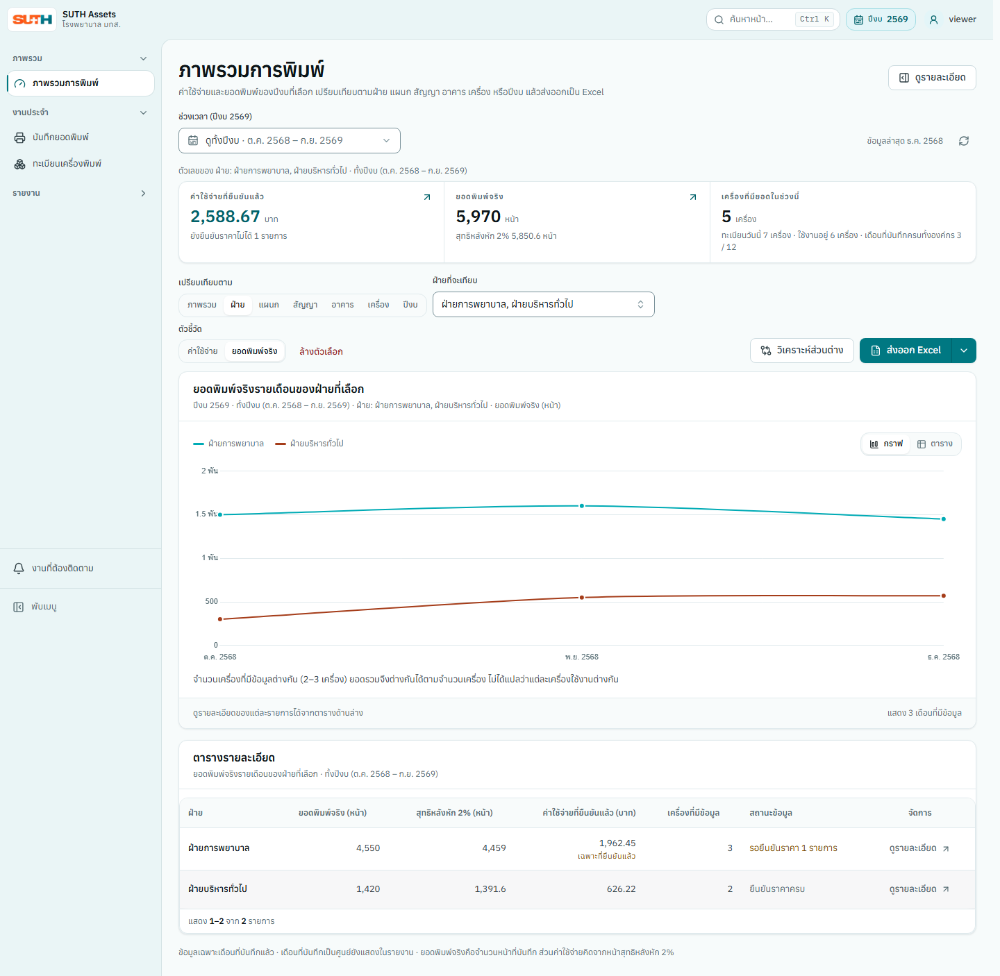

# ตรวจยอดและติดตามงานจากรายงาน

1. เลือกปีงบและอาคารบน Dashboard ความครบถ้วนแสดงเดือนที่กรอกครบทุกเครื่องเทียบกับทั้งปี ส่วนงานค้างนับเฉพาะเดือนที่จบแล้วตามเวลา Asia/Bangkok
2. กด **ไปกรอกยอดพิมพ์** ในรายการงานค้างเพื่อเปิดเดือนเก่าสุด พร้อมอาคารและเครื่องที่ยังไม่กรอก หลังบันทึกระบบโหลดความคืบหน้าใหม่ ยอดศูนย์ที่บันทึกแล้วนับว่าได้กรอก
3. คลิกจุดในกราฟแนวโน้มเพื่อดู Dashboard ของเดือนนั้น กราฟยังคงทั้งปี และเลือกเดือนผ่านมุมมองตารางของกราฟได้ด้วย ตัวเลขความครบถ้วนยังอ้างอิงทั้งปี
4. หน้าเปรียบเทียบเริ่มจากทุกเดือนที่มีข้อมูลในปีงบที่เลือก ล้างเดือนที่เลือกเพื่อกลับไปดูทั้งหมด เดือนที่ไม่มีข้อมูลแสดงเป็นช่องว่าง ไม่ใช่ศูนย์
5. ค้นหารายการรายเครื่องด้วย Serial หรือรุ่น กด **ขยายตาราง** เพื่อดูเต็มหน้าจอ คำค้น การเรียง และข้อมูลที่กรอกค้างยังอยู่ กด Escape หรือย่อตารางเพื่อกลับ
6. เปลี่ยนไทย/อังกฤษได้ในเมนูบัญชีผู้ใช้ ระบบโหลดหน้าใหม่ ภาษาอังกฤษใช้ ค.ศ. พร้อมปีงบ พ.ศ. อ้างอิง และคงชื่อข้อมูลตามต้นฉบับ
7. หน้ารายงานสรุปยอดพิมพ์แยกเครื่องที่ย้ายระหว่างปีเป็นแถวตามช่วงเดือนที่อยู่แต่ละที่ ยอดหนึ่งเดือนอยู่แถวเดียวตามที่ตั้งของเดือนนั้น ([ADR-0014](../decisions/0014-resolve-overlapping-location-history.md)) ตัวกรองอาคาร ชั้น ฝ่าย และแผนกจึงเห็นยอดตอนที่เครื่องอยู่ที่นั่น ส่วนยี่ห้อ สัญญา และสถานะเครื่องใช้ค่าปัจจุบันของเครื่อง ตัวกรอง **ยอดในเดือนที่แสดง** บอกเพียงว่ามียอดบันทึกไว้หรือไม่ ไม่ใช่งานค้าง — งานค้างจริงดูที่การแจ้งเตือน

ไฟล์รายงาน Excel มีแผ่นบริบทแยกสำหรับเวลาออกรายงานและตัวกรองที่ส่งจากหน้ารายงาน ดูตำแหน่งพร้อมเดือนในรายงานย้อนหลัง โดยเฉพาะเครื่องที่ย้ายระหว่างปี เดือนที่ไม่มียอดเป็นเซลล์ว่าง ส่วน 0 คือยอดศูนย์ที่บันทึกจริง

## เปรียบเทียบและกลับมาดูต่อ

ภาพใช้ข้อมูลตัวอย่างสำหรับอธิบายหน้าจอ

- Dashboard เลือกมิติอาคารหรือเครื่องได้ อาคารอ้างอิงสถานที่ในเดือนที่บันทึก ส่วนเครื่องที่ย้ายยังเป็นเส้นเดียว เลือกเครื่องได้สูงสุด 8 เครื่อง และค้นด้วย Serial รุ่น หรือสถานที่
- เลือก **ปีงบ** บน Dashboard หรือหน้าเปรียบเทียบเพื่อวางหลายปีบนแกน ต.ค.–ก.ย. ค่าเริ่มต้นคือปีงบนี้กับปีก่อน เลือกได้สูงสุด 3 ปี และจำกัดขอบเขตเป็นฝ่าย แผนก อาคาร หรือเครื่องหนึ่งรายการได้ หน้ารายละเอียดเครื่องมี **เทียบกับปีงบก่อน** เมื่อปีนั้นมีในระบบ เดือนที่ไม่ได้บันทึกยังว่าง
- ระบบจำตัวเลือกของแต่ละมิติและมุมมองของหน้าในแท็บนี้ เมื่อกลับจากเมนูหรือโหลดหน้าใหม่ ลิงก์ที่มีตัวกรองของตัวเองมีลำดับก่อนความจำ เปลี่ยนปีงบจะล้างเดือนที่เลือก ใช้ **ล้างตัวเลือก** บน Dashboard เพื่อกลับค่าเริ่มต้น
- อันดับอยู่ในไฟล์ Excel ของ Dashboard และค่าใช้จ่ายแยกแผนกในแผ่น **อันดับ** พร้อมกราฟ 10 อันดับสูงสุดและต่ำสุด ถ้ามีรายการน้อยกว่า 10 กราฟใช้เท่าที่มี ไม่จัดอันดับเงินเมื่อราคายังยืนยันไม่ครบ; ไฟล์แยกแผนกจะระบุชัดเมื่อใช้หน้าสุทธิแทน
- เมื่อเปลี่ยนช่วงบน Dashboard หรือหน้าเปรียบเทียบ ข้อมูลเดิมจะจางลงพร้อมคำอธิบายช่วงเดิมจนข้อมูลใหม่พร้อม การส่งออกและเปิดรายละเอียดรอข้อมูลใหม่ก่อน

**ความครบถ้วน:** ตัวส่วนของแต่ละเดือนคือเครื่องที่ต้องบันทึกยอดในเดือนนั้นตามช่วงความรับผิดชอบ ไม่ใช่จำนวนเครื่อง active วันนี้ เดือนที่ยังมีเครื่องซึ่งไม่ได้ตรวจยืนยันการติดตั้งจะแสดงว่า "ยังยืนยันไม่ได้" ไม่ใช่ครบหรือค้าง ดู [ADR-0018](../decisions/0018-separate-installation-status.md)
