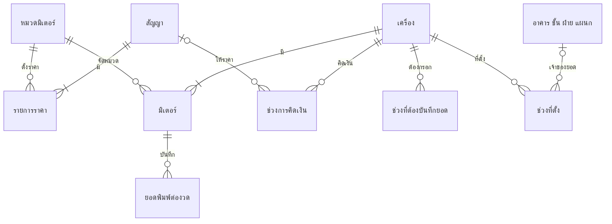

# โมเดลข้อมูล

ตารางและหน้าที่ — โครงสร้างเต็มพร้อมชนิดข้อมูลและ constraint อยู่ที่ `database/schema.sql` ซึ่งเป็น source of truth

รูปนี้แสดงเฉพาะแนวคิดที่ใช้คิดเงินและจัดยอด ชื่อกล่องเป็นคำในโดเมน ไม่ใช่ชื่อตาราง คำที่นิยามแล้วอยู่ใน [CONTEXT.md](../../CONTEXT.md) สัญญาต้องมีรายการราคาและเครื่องต้องมีมิเตอร์อย่างน้อยหนึ่งรายการตาม [ADR-0023](../decisions/0023-contract-term-price-lines-and-meters.md) แต่ฐานข้อมูลไม่ได้บังคับข้อนี้ ช่วงเวลาสามชุดของเครื่องตอบคนละคำถามและห้ามรวมกัน ปีงบไม่มีเส้นเชื่อมกับตารางใด เพราะได้จากการเทียบเดือนของยอดกับช่วงเดือนของปีงบ

| กลุ่ม | ตาราง | หน้าที่ |
|---|---|---|
| ผู้ใช้ | `users` | บัญชี รหัสผ่านแบบ bcrypt hash และ role |
| Master Data | `brand`, `building`, `floor`, `division`, `department` | ข้อมูลอ้างอิงของอุปกรณ์และรายงาน |
| Master Data | `brand_alias`, `building_alias`, `division_alias` | ชื่อที่ไฟล์ต่างชุดใช้เรียกรายการเดียวกัน ([ADR-0025](../decisions/0025-master-data-aliases.md)) |
| ปีงบและสัญญา | `fiscal_year`, `contracts`, `contract_price_line` | ช่วงปีงบ อายุสัญญา และราคาต่อหมวดมิเตอร์ |
| ทรัพย์สิน | `devices` | ข้อมูลประจำเครื่อง ตำแหน่งปัจจุบัน สัญญา และสถานะ |
| ประวัติ | `device_location_history` | ช่วงเวลาที่เครื่องอยู่แต่ละสถานที่และหน่วยงาน |
| ประวัติ | `device_service_period` | ช่วงเวลาที่เครื่องต้องบันทึกยอดพิมพ์ (ติดตั้งแล้ว + ใช้งานอยู่) |
| ประวัติ | `device_contract_history` | ช่วงเวลาที่เครื่องถูกคิดเงินภายใต้สัญญาฉบับไหน ด้วยราคาเฉพาะเครื่องเท่าไหร่ |
| มิเตอร์ | `meter_category`, `device_meter` | หมวดราคาและมิเตอร์ขาวดำ/สีของแต่ละเครื่อง |
| การใช้งาน | `print_transactions` | ยอดพิมพ์หนึ่งรายการต่อมิเตอร์ต่องวด พร้อมเลขต้นงวด/สิ้นงวด |
| งานนำเข้า | `import_session` | งานนำเข้าไฟล์หนึ่งแถวต่อหนึ่งไฟล์ที่อัปโหลด: สถานะ การตัดสินใจ ผลตรวจ และผลที่บันทึก ไฟล์ต้นฉบับอยู่บนดิสก์ของ API ไม่อยู่ในฐาน ([ADR-0027](../decisions/0027-import-session-lifecycle.md)) |
| งานนำเข้า | `import_session_event` | ประวัติของงานนำเข้าแต่ละงาน ว่าใครทำอะไรเมื่อไร ยังอยู่แม้งานหมดอายุ |
| ตรวจย้อนหลัง | `audit_log` | การแก้ไขด้วยมือทุกครั้ง: ใครแก้อะไร เมื่อไร จากค่าอะไรเป็นค่าอะไร เก็บชื่อผู้ใช้เป็นสำเนา และห้ามเก็บรหัสผ่านหรือ hash ([ADR-0035](../decisions/0035-audit-log.md)) |

สองตารางประวัติตอบคนละคำถาม และ **ใช้กฎการเทียบเดือนต่างกันโดยตั้งใจ**

| ตาราง | ตอบคำถามว่า | ปลายช่วง |
|---|---|---|
| `device_location_history` | ยอดของเดือนนี้เป็นของหน่วยงานไหน | **ไม่รวม** เดือนที่ย้าย — ยอดหนึ่งเดือนมีเจ้าของได้คนเดียว |
| `device_service_period` | เดือนนี้เครื่องไหนต้องกรอกยอด | **รวม** เดือนที่ปิดช่วง — ติดตั้งอยู่แม้บางส่วนของเดือนก็ต้องกรอก ([ADR-0018](../decisions/0018-separate-installation-status.md) Q20) |

กฎอยู่ที่ `apps/api/src/shared/effective-location-sql.js` และ `packages/domain/service-period.cjs` ตามลำดับ — ห้ามรวมเป็นฟังก์ชันเดียวกันเพราะเห็นว่าหน้าตาคล้ายกัน

## View

| View | หนึ่งแถวคือ | หน้าที่ |
|---|---|---|
| `v_monthly_kpi` | มิเตอร์ต่องวด | **ที่เดียวที่คิดเงิน** — หาราคาที่มีผลในงวดนั้น ปัดยอดตามใบแจ้งหนี้ และแบ่งกลับเป็นค่าพิมพ์รายมิเตอร์ ดู [สายเงิน](../explanation/domain.md#ยอดพิมพ์และค่าใช้จ่าย) ห้ามคำนวณเงินซ้ำนอก view นี้ |
| `v_contract_invoice` | สัญญาต่องวด | ยอดตามใบแจ้งหนี้รวม VAT: ค่าพิมพ์จาก `v_monthly_kpi` บวกค่าเช่าคงที่ แล้วปัด VAT ครั้งเดียว สัญญาที่มีค่าเช่าคงที่มีแถวทุกงวดในอายุสัญญาแม้ไม่มียอดพิมพ์ ([ADR-0023](../decisions/0023-contract-term-price-lines-and-meters.md)) |
| `v_compare_usage_costs` | มิเตอร์ต่องวด | `v_monthly_kpi` พร้อมปีงบและชื่อยี่ห้อ ที่ตั้ง และหน่วยงาน **ตามค่าปัจจุบันของเครื่อง** — รายงานย้อนหลังต้องแทนที่ตั้งด้วยช่วงที่มีผลในเดือนนั้นเองผ่าน `apps/api/src/shared/effective-location-sql.js` |
| `v_summary_by_building` | อาคาร | ผลรวมจำนวนพิมพ์หลังหัก 2% และค่าพิมพ์ตามอาคาร **ปัจจุบัน** ของเครื่อง ทุกงวดรวมกัน พร้อมจำนวนรายการที่หาราคาไม่ได้ โค้ดของ API ไม่ได้อ่าน view นี้ |

## ข้อบังคับที่ฐานข้อมูลเป็นคนกัน

| ตาราง | ข้อบังคับ | กันอะไร |
|---|---|---|
| `print_transactions` | `UNIQUE KEY uq_meter_month (meter_id, month)` | ยอดของมิเตอร์เดียวกันในงวดเดียวกันถูกนับซ้ำ |
| `contract_price_line` | `UNIQUE KEY (contract_id, category_id)` | สัญญามีราคาซ้ำในหมวดเดียวกัน |
| `device_meter` | `UNIQUE KEY (device_id, category_id)` | เครื่องมีมิเตอร์หมวดเดียวกันซ้ำ |
| `print_transactions` | `CHECK chk_print_transactions_month_ce` | เดือนแบบ พ.ศ. หลุดเข้ามาไม่ว่าทางไหน |
| `fiscal_year` | `CHECK chk_fiscal_year_start_month_ce` / `..._end_month_ce` | ช่วงเดือนของปีงบถูกกรอกเป็น พ.ศ. |
| `device_service_period` | `CHECK chk_device_service_period_order` | ช่วงที่สิ้นสุดก่อนเริ่ม ซึ่งจะทำให้เดือนนั้นหายจากตัวส่วนเงียบๆ |
| `device_contract_history` | `CHECK chk_device_contract_history_order` | ช่วงการคิดเงินที่สิ้นสุดก่อนเริ่ม |
| `contracts` | `CHECK chk_contracts_term_order` | ช่วงที่สัญญามีผลซึ่งสิ้นสุดก่อนเริ่ม |
| `*_alias` | `UNIQUE KEY (alias)` | ชื่อเรียกอื่นเดียวชี้สองรายการ — การห้ามชนชื่อหลักอยู่ใน API เพราะคนละตาราง |

## รูปแบบค่าที่ต้องรู้

| คอลัมน์ | รูปแบบ | หมายเหตุ |
|---|---|---|
| `fiscal_year.year` | `VARCHAR` เลข **พ.ศ.** | เช่น `"2569"` |
| `fiscal_year.start_month` / `end_month` | `CHAR(7)` `YYYY-MM` **ค.ศ.** | ปีงบ 2569 = `2025-10` ถึง `2026-09` |
| `print_transactions.month` | `VARCHAR(7)` `YYYY-MM` **ค.ศ.** | รับเข้าได้ทั้ง พ.ศ./ค.ศ. แต่เก็บเป็น ค.ศ. |
| `device_location_history.effective_to` | `DATE` หรือ `NULL` | `NULL` = ช่วงปัจจุบัน |
| `device_service_period.effective_to` | `DATE` หรือ `NULL` | `NULL` = ยังรับผิดชอบยอดอยู่ |
| `devices.status` | `active` / `repair` / `retired` | `retired` คือแทงจำหน่าย ประวัติยังอยู่ |
| `devices.installation_status` | `installed` / `not_installed` / `NULL` | **`NULL` = ยังไม่มีใครตรวจ ไม่ใช่ "ยังไม่ได้ติดตั้ง"** |
| `devices.service_unverified_before` | `DATE` หรือ `NULL` | `NULL` = ยืนยันครบทุกช่วงเวลา · วันที่ = ก่อนวันนั้นยังยืนยันไม่ได้ |
| `contracts.effective_from` / `effective_to` | `DATE` บังคับ | อายุสัญญาที่ราคา ค่าเช่า และ VAT มีผล ([ADR-0023](../decisions/0023-contract-term-price-lines-and-meters.md)) |
| `contract_price_line.price_per_page` | `DECIMAL(10,4)` | ราคาต่อหน้าของหนึ่งหมวดมิเตอร์ |
| `device_contract_history.contract_id` | `INT` หรือ `NULL` | `NULL` = รู้ว่าช่วงนั้นไม่ได้ผูกสัญญา ต่างจาก "ไม่มีช่วงเลย" ซึ่งแปลว่าไม่รู้ |
| `v_monthly_kpi.total_cost` | `DECIMAL` หรือ `NULL` | ส่วนของยอดรายการราคาต่องวดที่กระจายกลับมายังมิเตอร์ · `NULL` = หาราคาไม่ได้ ซึ่งทางเขียนปฏิเสธแล้ว จึงเหลือเฉพาะยอดเก่าก่อน [ADR-0021](../decisions/0021-contract-price-applies-on-save.md) |

เหตุผลของรูปแบบเดือนอยู่ที่ [ADR-0002](../decisions/0002-store-months-in-common-era.md)
